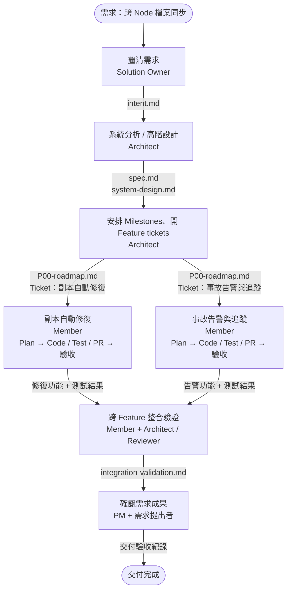
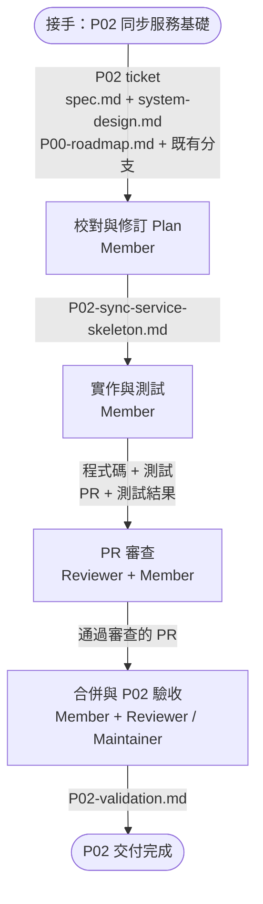

# Cross-Node File Synchronization Framework

## 示範目的

**示範 AI coding 時代快速交付的「降龍十八掌第一式：亢龍有悔」。**
目標：一個人約 3 個月工作量的 framework，3 天內交付可驗收的版本。
亢龍有悔的要義是有餘不盡，這裡的餘力是 Solution Owner 拆出可驗收的工作，讓人與 agent 平行化開發，高速交付高品質的 PR。

- **Solution Owner（Architect、PM 等）**：拿到大需求，釐清目標與限制，分析系統、切出 Milestones 與 Features。
- **Member 承接 Feature**：選 AI coding 工具，一條龍完成 **Design / Plan → Code / Test → Review / PR → 驗收**。
- **平行開發、快速回饋**：依賴解除的工作使用獨立 worktree，小批次送 PR，讓 review 跟得上開發。
- **日夜接力**：白天把任務與邊界寫進 `goal.md`，晚上用 `/loop` 讓 agent 推進；隔天人讀報告、review 與驗收。

```text
Milestone：可完整驗收的有感能力
└─ Features：達成這個能力所需的功能
   └─ ticket：記錄範圍、指派 Member、追蹤進度
```

以下直接使用本專案的文件示範。正式交付規劃放 [P00 roadmap](docs/superpowers/plans/P00-roadmap.md)，教學與操作示例放在這份 README。

## 目錄

- [示範目的](#示範目的)
- [真實專案示範：工作流](#工作流)
  - [第一層：Solution Owner 分析與拆分](#第一層solution-owner-分析與拆分)
  - [第二層：Member 用 AI coding 完成 Feature](#第二層member-用-ai-coding-完成-feature)
  - [實際交付範例：P01 ticket → PR](#實際交付範例p01-ticket--pr)
  - [平行開發、夜間執行與驗收](#平行開發夜間執行與驗收)
  - [本專案的示範文件](#本專案的示範文件)
- [技術定義與補充（Appendix）](#appendix)
  - [角色與技術名詞](#角色與技術名詞)
  - [層級定義與文件對照](#層級定義與文件對照)
  - [選用 Skills](#選用-skills)
  - [Skills 使用前提](#skills-使用前提)
  - [工具操作注意事項](#工具操作注意事項)
  - [需要拆票時](#需要拆票時)
  - [工作流參照](#工作流參照)
  - [有 Milestone 的大型需求](#有-milestone-的大型需求)
  - [沒有 Milestone 的一般需求](#沒有-milestone-的一般需求)
  - [單一 ticket 的文件交接：P03 ingest](#單一-ticket-的文件交接)

## 工作流

**真實專案：跨 Node 交易檔案同步框架。** Source 保存同步義務，Target 透過 HTTP pull 取得副本，重試、自查與對帳處理故障與恢復。

先看 Solution Owner 如何把大需求拆成可交付的 Features，再展開 Member 的開發與日夜交接。

### 第一層：Solution Owner 分析與拆分

**例子：交易在另一個 DC 接手處理時，也要讀得到前序產生的檔案。** 團隊要建立跨 Node 檔案同步框架，完整背景見 [intent.md](intent.md)。

#### 誰做什麼、交接什麼

| 接力步驟 | 負責人與本例工作 | 交給下一步 |
| --- | --- | --- |
| **① 說清楚要什麼** | Solution Owner（PM／Architect）：確認哪些交易檔要複製、故障時要維持什麼能力 | `intent.md`、範圍與驗收目標 |
| **② 設計整體、拆功能** | Solution Owner 中負責設計的 Architect：做系統分析與高階設計，安排 Milestones，為各 Feature 開 ticket | `spec.md`、`system-design.md`、`P00-roadmap.md`、Feature tickets |
| **③ 接一個 Feature 做完** | Member：例如承接「副本自動修復」，寫 plan、實作、測試與送 PR | Plan／Tasks、Code、Tests、PR、Feature 驗收結果 |
| **④ 串起來驗收** | Member 與 Architect／Reviewer 驗證修復及告警；PM 確認需求成果 | 整合驗證與交付紀錄 |

Solution Owner 對整體需求與方案負責；可由 PM、Architect 協作或由同一人兼任。Member 對承接的 Feature 負責，Reviewer 協助確認品質。

#### 本專案怎麼切 Milestones 與 Features

**每個 Milestone 都要交付一項使用者有感、能完整驗收的能力；底下列出達成它所需的 Features。** Ticket 用來記錄與指派 Feature，不取代功能名稱。

```text
大需求：跨 Node 交易檔案同步
├─ M1：檔案發布後，交易能在指定 Node 讀到正確副本
│  ├─ Feature：可靠發布來源檔案
│  ├─ Feature：拉取並保存指定副本
│  └─ Feature：App 透過 library 讀寫檔案
└─ M2：約定故障發生後，副本能恢復可讀、事故可追蹤
   ├─ Feature：副本自動修復
   ├─ Feature：重建與還原後恢復同步
   └─ Feature：事故告警與追蹤
```

| Milestone | 使用者得到什麼 | 完整驗收情境 |
| --- | --- | --- |
| **M1 跨 Node 讀得到檔案** | 交易可在指定 Node 使用先前由另一個 Node 產生的檔案。 | App 發布 → Target 收到已驗證副本 → Consumer 讀到相同內容；持久化等必要驗收通過。 |
| **M2 故障後恢復使用** | 約定故障解除後，副本恢復可讀，ops 能追蹤事故與恢復結果。 | 注入副本遺失／損壞、服務重啟，以及設計支援的 DB 還原情境，驗證恢復路徑、正確內容與事故紀錄。 |

**每個 Milestone 都有自己的端到端驗收，不以底下的票全關閉作為完成證據。** M1 完成就能展示跨 Node 讀取，不必等 M2；M2 可以建立在 M1 上，「可獨立驗收」不表示彼此沒有實作依賴。

Architect 的 Feature ticket 寫清楚 **範圍、spec／設計連結、驗收條件、Blocked by**。例如「副本自動修復」需要既有回報與重交付能力；Member 接手後才寫 `replica-repair-plan.md` 並實作。

這六個 Features 已有 [P00 的實作計畫對照](docs/superpowers/plans/P00-roadmap.md#milestone--feature--實作計畫對照)，包含共用工作與分批驗收；尚未建立 tickets。各工作分支依範圍補上詳細 plan，實作狀態以該分支的進度與驗收證據為準。分在同一 Milestone 不代表都能同時開工。

以下流程聚焦 M2 的修復與告警。假設必要上游已可用，共用介面及修改分工已確認，兩張 Feature tickets 就能平行開發。



整合驗證時，製造一份損壞副本，確認它被偵測、修復，事故也能查到並告警。

接著用 P02「同步服務基礎」實際示範開票與 plan 交接。它是 M1 的共用基礎工作；只有需要再分工或分批交付時，才往下細拆更多 tickets。

#### 從 Feature 開成 ticket

Architect 從 P00 選出 P02「同步服務基礎」，用 Matt `to-tickets` 整理成一張可交接的 ticket。**本例選用 Matt 開票、Superpowers 寫 plan；團隊可以換工具，交接契約相同。**

實際產出：[P02 ticket #1：Node 本地同步服務基礎](https://github.com/yschiang/cross-dc-xfer/issues/1) → [P02 接續 plan](docs/superpowers/plans/P02-sync-service-skeleton.md)。這次是在已有 plan 與部分實作後補票，再用驗收條件校對後續工作。

| 欄位 | 內容 |
| --- | --- |
| **Milestone／交付範圍** | M1 共用基礎／P02 同步服務基礎 |
| **要完成什麼** | 每個 Node 能用有效的本地設定啟動同步服務、提供 Policy、驗證 Node 身分；設定或 DB 故障時有明確的保留、降級與恢復行為。 |
| **spec／設計決定行為** | SR-01、AC-CP／AC-CFG；system-design §3、§4、§8；相關決策的最新適用修訂。 |
| **roadmap 決定邊界** | P00 的 P02 範圍；掃描、傳輸、Consumer 讀取與 ops 操作由後續 Pxx 負責。 |
| **Blocked by** | P01 core 的已驗證介面；在依賴 P01 的工作分支續行，不需重新實作 P01。 |
| **怎麼驗收** | 壞設定不取代有效設定；Policy 含 Namespace 登錄；DB 恢復後可繼續初始化；Node 憑證正確綁定身分；重啟不重建既有代次。 |
| **Member 接手後補** | Plan／Tasks、PR、測試與驗收證據。既有程式碼與分支用來確認進度，不取代 spec。 |

本例的開票請求：

> 使用 to-tickets，依 spec、system-design 與 P00 的 P02 範圍開一張 ticket，列出驗收條件、排除項與依賴。讀取既有 P02 分支與 plan，標示哪些成果可沿用；這是實作後補票，不宣稱最初就由 ticket 啟動。

### 第二層：Member 用 AI coding 完成 Feature

Member 接下 [P02 ticket #1](https://github.com/yschiang/cross-dc-xfer/issues/1)，本例選用 Superpowers `writing-plans`。P02 原先已直接從設計寫 plan 並開始實作，所以這次做的是 **補票 → 校對與修訂 plan → 接續剩餘工作**。



1. **Design／Plan**：請 `superpowers:writing-plans` 讀 ticket、引用的契約與既有程式碼，逐條對照驗收條件，修訂 P02 plan。已完成的工作沿用；補齊 Namespace 登錄等缺漏，列出後續功能要使用的介面。
2. **Code／Test**：依核對後的 plan 接續實作，測試有效／無效設定、LKG 回退、Policy 輸出、DB 恢復與 Node 身分驗證。每個修正都有對應測試。
3. **Review／PR**：Member 先讓 agent review 並修正問題，再送 PR，附上 ticket、plan、測試命令與結果，交給 Reviewer 檢查。
4. **整合驗收**：在測試環境串起「啟動 → 取得 Policy → 拒絕壞設定 → 重啟恢復」，確認交接介面可用，將版本、命令與結果寫入 `docs/validation/P02-validation.md`。P02 通過不代表完整 M1 已通過。

本輪已發布 ticket，並準備本地 plan 修訂稿；接續前須與執行中的分支進度合併。Code／Test、PR 與整合驗收仍依工作分支的證據追蹤，不因開票就視為完成。OpenSpec 路線與工具細節見 [附錄](#選用-skills)。

### 實際交付範例：P01 ticket → PR

P01「來源檔案發布」先前已透過 Superpowers 完成 plan、實作與審查。本次用 Matt `to-tickets` 補建交接票，再把既有成果提交 PR，讓 Member 看到可直接參照的一組產出。

| 順序 | 實際產出 | 看什麼 |
| --- | --- | --- |
| ① Ticket | [P01 #2](https://github.com/yschiang/cross-dc-xfer/issues/2) | 能力、範圍、9 項驗收條件與下游依賴 |
| ② Plan | [P01 實作計畫](https://github.com/yschiang/cross-dc-xfer/blob/p01-core-finalize-pr/docs/superpowers/plans/P01-core-finalize.md) | 怎麼拆步驟；已完成的工作如何交接 |
| ③ Code／Test／PR | [PR #3](https://github.com/yschiang/cross-dc-xfer/pull/3) | 一個提交、程式差異、測試結果，透過 `Closes #2` 連回 ticket |
| ④ 驗收證據 | [P01-validation.md](https://github.com/yschiang/cross-dc-xfer/blob/p01-core-finalize-pr/docs/validation/P01-validation.md) | 每項 AC 對應哪些測試、在哪個環境執行、哪些尚未驗證 |

- **worktree 是工作位置，PR 才是提交審查的成果。** 原 P01 worktree 保留；提交分支 `p01-core-finalize-pr` 接到目前 main，原 P02 worktree 也保留。
- **目前狀態：** 本機 64 個測試通過，PR 待人工 review、尚未合併。Java 21 runtime 與真實 NAS 的驗收限制寫在證據裡。
- **依賴交接：** [P02 #1](https://github.com/yschiang/cross-dc-xfer/issues/1) 已設為依賴 P01 #2。P02 可沿用已取得的 core 開發，提交 PR 前再接上 P01 的正式整合版本。

這是「已有成果 → 補票 → 提交 PR」的真實範例。新 Feature 可先開 ticket，再由 Member 規劃與實作；兩者都要用驗收證據交付。

### 平行開發、夜間執行與驗收

#### 用 worktree 平行開發，用小批次 PR 交付

Features 或細拆後的 tickets，符合以下條件才一起開發：

- **依賴已解除**：所需上游功能已可用，介面與驗收條件已確認。
- **修改有分工**：共用檔案／模組的修改與整合順序已協調。
- **開發各自隔離**：使用獨立 branch／worktree，通常每張開發 ticket 一個 PR；Feature 負責人統籌整合。

可以先研究、寫 plan，不代表依賴上游的實作已可開工。`ready-for-agent` 表示票的內容可交接，仍要另查 Blocked by。

**快速 PR 的做法**：每次變更聚焦一個可驗證的成果，附 ticket／plan、測試結果與尚待驗證項目；通過 review 與 CI 就依整合順序交付。Feature 較大時先細拆 tickets，避免所有程式堆到最後才送審。

#### 晚上用 /loop 讀 goal.md，白天回來 review

本專案已有 [goal.md](goal.md) 與 [overnight-report.md](docs/reports/overnight-report.md) 作為任務與報告實例。`/loop` 是執行入口；目標、順序、邊界與停止條件寫在 `goal.md`。

| 時間 | 人／agent 做什麼 | 交接文件 |
| --- | --- | --- |
| **白天準備** | Member 選定工作範圍、確認依賴與環境，指定 worktree、測試與停止條件。 | `goal.md` ＋ plan／tasks |
| **晚上執行** | `/loop` 每輪讀任務書與 ledger，接續未完成項，實作 → 測試 → 修正 → review，更新已完成內容與卡點。 | 各 worktree 的 `progress.md` ＋ commits／測試結果 |
| **早上驗收** | 人先讀摘要，再按 branch／commit 檢查 diff、測試證據與待決事項，決定修正、整合或安排實機驗收。 | `overnight-report.md` ＋ PR／驗收紀錄 |

**本夜的具體目標是 P01 → P02 → P03**：完成 Finalize、服務骨架與原子 ingest，串起「發布 → 掃描 → 同步義務入庫」。這是 M1 的 Source 路徑，跨 Node 傳輸與完整 M1 驗收仍需後續工作。

這三項有依賴，依序推進；平行化用在無依賴的 Features／tickets。每個 worktree 的 ledger 分開保存；本夜依 `goal.md` 留成果在工作分支，早上按 P01 → P02 → P03 review 與決定整合。

```text
/loop：讀 goal.md + progress.md
  → 接續下一項 → Code / Test / Review → 更新 progress.md
  → 未完成且可繼續：下一輪
  → 完成或遇停止條件：寫 overnight-report.md → 人 review／驗收
```

早晨報告須能直接回答：**做到哪個 commit、哪些測試通過、哪些沒驗、改了哪些判斷、下一步要人決定什麼。** 完成時停止 loop；同一個阻礙反覆出現而無新進展時，記錄證據與卡點交接。

#### 人回來後，怎麼驗收

| 時點 | 用本例說明 | 負責人／證據 |
| --- | --- | --- |
| Feature 交接前 | 確認哪些情況算副本損壞、誰授權修復、怎樣才算恢復 | Architect；spec 與驗收條件 |
| 開發過程中 | 驗證偵測、回報、修復、重試與失敗行為 | Member；自動化測試結果 |
| Feature 完成前 | 從損壞一路走到副本正確且可讀 | Member + Reviewer；PR 與功能驗收紀錄 |
| Features 串接後 | 修復能完成，事故也有紀錄與告警 | Member + Architect／Reviewer；整合測試紀錄 |
| 整體交付前 | 在約定環境確認需求目標，必要時驗 NAS failover 與容量 | Maintainer 協調，PM 確認成果；交付驗收紀錄 |

整合路徑能執行就開始驗證，相關變更後重跑；不必等全部 Features 完成。證據記錄版本、環境、執行方式與結果，未執行的必要檢查要明列。純文件修改則檢查內容與連結，無須跑完整 E2E。

實作若發現契約缺口，Member 與 Architect 先更新相關 spec／設計再續行。交付後的部署、監控與使用回饋，形成下一輪需求。

### 本專案的示範文件

照這個順序讀，可以看到一個需求如何變成可交接、可驗收的工作。**①–⑤ 是 Solution Owner 的交接準備，⑥–⑦ 由 Member 規劃與執行，⑧ 回到人的 review／驗收。**

| 順序 | 這一步確認什麼 | 打開這份範例 |
| --- | --- | --- |
| **① 釐清目的** | 為什麼做、要解決誰的問題？ | [intent.md](intent.md) |
| **② 定義需求** | 要做到什麼，怎樣算達標？ | [spec.md](docs/spec.md) |
| **③ 設計方案** | 系統怎麼分工，介面與故障行為怎麼定？ | [system-design.md](docs/design/system-design.md)、[design-decisions.md](docs/design/design-decisions.md) |
| **④ 安排交付** | 切成哪些 Milestones／Features，誰依賴誰？ | [P00-roadmap.md](docs/superpowers/plans/P00-roadmap.md) |
| **⑤ 開 Feature ticket** | Member 接手的範圍、依據與驗收條件是什麼？ | [P02 ticket #1](https://github.com/yschiang/cross-dc-xfer/issues/1) |
| **⑥ 寫實作 plan** | 實作與測試要分成哪些步驟？ | [P02-sync-service-skeleton.md](docs/superpowers/plans/P02-sync-service-skeleton.md) |
| **⑦ 交給 agent 執行** | 今晚做哪些工作、如何續行、何時停止？ | [goal.md](goal.md) |
| **⑧ Review 與驗收** | 做到哪個 commit、哪些測試通過、還需人決定什麼？ | [P01 PR #3](https://github.com/yschiang/cross-dc-xfer/pull/3) 與 [驗收證據](https://github.com/yschiang/cross-dc-xfer/blob/p01-core-finalize-pr/docs/validation/P01-validation.md)；夜間交接見 [overnight-report.md](docs/reports/overnight-report.md) |

⑤、⑥ 是同一個 P02 Feature 的實際 ticket 與接續 plan；ticket 已發布，plan 修訂稿尚待與執行分支整合。閱讀設計時，可搭配 [CONTEXT.md](CONTEXT.md) 查詞彙、[ADRs](docs/adr/) 查架構理由。

## Appendix

技術定義與補充資料集中在這裡，主文依實際交接順序閱讀即可。

### 角色與技術名詞

| 名稱 | 本文用途 |
| --- | --- |
| **Solution Owner** | 負責大需求、方案與交付目標；Architect、PM 等可共同承擔。 |
| **Member** | 承接 Feature，運用 AI coding 完成詳細設計、實作、測試與交付。 |
| **Reviewer／Maintainer** | 分別負責審查品質與整合版本；角色可兼任。 |
| **SA／SD** | 系統分析／系統設計活動；本文不用 SA 縮寫代稱 Solution Architect。 |
| **worktree** | 同一 Git repo 的獨立工作目錄，通常配一個開發分支，讓不同工作可同時進行。共用介面與修改仍要協調。 |
| **PR** | 一份可審查的變更與證據，連回 ticket／plan。 |
| **goal.md** | agent 的任務書：目標、優先序、允許範圍、驗證與停止條件。 |
| **progress.md** | 每輪接續用的 ledger：已完成項、commit、測試、判斷與卡點。 |
| **overnight-report.md** | 人回來時先讀的交接摘要，連到實作與驗收證據。 |
| **/loop** | 重複執行任務的入口；此 repo 的任務規則由 `goal.md` 指定，實際啟動方式依 agent 環境。 |

### 層級定義與文件對照

| 層級 | 用來回答什麼 | 誰負責 | 放在哪裡 |
| --- | --- | --- | --- |
| **Milestone（可選）** | 這一批交付後，系統達到什麼可驗收的目標？ | Architect 與交付負責人 | Roadmap，必要時對應 tracker 的 Milestone |
| **Feature** | 提供哪一項完整能力？ | Architect 定義，Member 承接並負責交付 | Spec、roadmap、Member 的 Feature plan |
| **Ticket** | 這次完成什麼可驗收的工作？依賴誰？ | Architect 建立 Feature tickets；Member 必要時再細拆 | Tracker 中的 ticket，包含驗收條件與 Blocked by |
| **Task** | 完成 Feature 或 ticket，需要哪些實作與測試步驟？ | Member | Implementation plan 或 OpenSpec 的 `tasks.md` |

**Member 承接 Feature，task 是 plan 裡的實作步驟。** Ticket 用來追蹤工作：可以一張涵蓋 Feature，需要分工或分批驗收時才拆多張。Milestone 可省略。

```text
Feature spec／設計 → 選工具 → Plan / Tasks → Code → Tests → PR → 驗收
需要分工：Plan → to-tickets → 各票開發與 PR → Feature 整合驗收
```

Feature plan 說明整體做法、拆分、順序與驗證；各 ticket 只細化自己的 tasks，連回同一份 plan，不必複製一整份文件。純驗證 ticket 可交付驗收紀錄，有程式或文件變更才需要 PR。

本專案對照如下；[P00](docs/superpowers/plans/P00-roadmap.md#milestone--feature--實作計畫對照) 保存交付目標、實作範圍、依賴與驗收條件。

| Milestone | Feature | 主要 Pxx 範圍 |
| --- | --- | --- |
| M1 | 可靠發布來源檔案 | P01 + P03 |
| M1 | 拉取並保存指定副本 | P04 + P05 |
| M1 | App 透過 library 讀寫檔案 | P10，整合 P01／P02 與 service `/locate` |
| M2 | 副本自動修復 | P06 + P07，整合 P04／P05 與讀取保護 |
| M2 | 重建與還原後恢復同步 | P08，整合 P03／P06／P07 與既有交付流程 |
| M2 | 事故告警與追蹤 | P11 + P12，使用 P05–P11 的狀態與指標 |

P02 是共用服務基礎，P09 是發布／傳輸的生命週期支援；P13／P14 按 Milestone 提供 NAS、E2E 與負載驗收。共用部分只實作一次，在 tickets 上明列負責人與依賴。

**Pxx 是技術交付範圍。** 開票時引用 spec、確認修改邊界與驗收條件；詳細 plan 與實作進度以對應工作分支為準。

兩種拆分方式見 [附錄：有 Milestone](#有-milestone-的大型需求) 與 [無 Milestone](#沒有-milestone-的一般需求)。


### 選用 Skills

**按工作選工具，不必把每套工具都跑一次。** Member 的兩條常用路線：

| Member 選的工具 | 設計 Plan | 實作 | 驗證 |
| --- | --- | --- | --- |
| **OpenSpec** | `openspec-propose` | 計畫確認後，使用 `openspec-apply-change` | `openspec-verify-change` ＋ 專案測試 |
| **Superpowers** | `superpowers:writing-plans` | `superpowers:subagent-driven-development` 或 `superpowers:executing-plans`，依環境選用 | 專案測試 ＋ PR review |

其他工作可依需要搭配：

| 要做什麼 | 誰使用 | Skill／工具 | 交接結果 |
| --- | --- | --- | --- |
| 釐清需求與設計問題 | PM／Architect | Matt `grill-with-docs`；需要探索時可用 `openspec-explore` | 共用詞彙、需求與設計結論 |
| 把討論整理成 spec | Architect | Matt `to-spec` | Feature spec，引用既有系統契約 |
| 依 spec／roadmap 建立 Feature tickets | Architect | Matt `to-tickets` | 可交接的 Feature 範圍、驗收條件與依賴 |
| 工作較大，需要細拆 tickets | Member，Architect 協助 | Matt `to-tickets` | 工作範圍、驗收條件與 Blocked by |
| 實作前已有 plan，想用 Matt 路線 | Member | Matt `implement` | Code、tests、review 與 commit |
| 審查變更 | Reviewer | Matt `code-review` | 對照 repo 規則與 spec 的審查結果 |
| 整合與歸檔 | Maintainer／Member | Git 工具；可用 `superpowers:finishing-a-development-branch`，OpenSpec 路線另用 `openspec-archive-change` | 合併版本、規格與歸檔文件 |

`to-spec`、`to-tickets` 的原始流程會發布到 tracker；只要草稿時，要明說「只整理草稿，不發布」。實際 skill 名稱、設定與副作用見 [使用前提](#skills-使用前提) 和 [工具操作注意事項](#工具操作注意事項)。

### Skills 使用前提

這份對照依 2026-09-23 的本機檔案核對；每位 Member 須確認自己的環境，安裝在磁碟上不等於當前 session 已載入。

| 項目 | 核對結果／使用前提 |
| --- | --- |
| Matt skills | 本機已有 `to-spec`、`to-tickets`、`implement`、`ask-matt` 等，來源紀錄為 `mattpocock/skills`。部分是需明確呼叫的 skills，不會出現在自動選用清單。 |
| Matt 的 repo 設定 | 使用 `setup-matt-pocock-skills` 設定 tracker、triage labels 與 domain 文件位置。本 repo 尚缺 `docs/agents/issue-tracker.md`；已安裝 skill 不代表這項設定已完成。 |
| Superpowers | 本機 Claude Code cache 有 6.3.0 的相關 skills；其他 agent 環境須確認安裝／載入，不能直接假設可呼叫。 |
| OpenSpec | 本機有相關 skills 與 CLI 1.13.1；repo 使用 `spec-driven` 配置。實際產物與位置以 CLI 回報為準。 |

不確定該用哪個 Matt skill，可查 `ask-matt`。大型工作若仍有大量跨 session 的未決設計，可用 `wayfinder` 建立**決策 tickets**；它不是把已定案 roadmap 轉成 feature tickets 的替代品，而且會操作 tracker。一般拆票用 `to-tickets`。

本文的 [P02 ticket #1](https://github.com/yschiang/cross-dc-xfer/issues/1)、[P01 ticket #2](https://github.com/yschiang/cross-dc-xfer/issues/2) 與 [P01 PR #3](https://github.com/yschiang/cross-dc-xfer/pull/3) 已建立。其他 Feature tickets 與副本修復範例檔仍是示意。`goal.md` 與夜間報告是已有的工作紀錄。使用前確認所選工具已設定。

### 工具操作注意事項

- **文件用連結串接**：需求、設計、ticket、plan 與 PR 互相引用；Feature spec 沿用系統 spec，OpenSpec 歸檔不會自動同步 `docs/spec.md`。
- **變更對應文件**：契約改動更新 spec／設計與相關決策；實作步驟調整更新 plan。文件有衝突時先釐清，再繼續受影響的工作。
- **選一份權威 plan**：OpenSpec design／tasks 或 Markdown plan 擇一；ticket 與 PR 連回它。OpenSpec 的實際產物依 schema，位置以 CLI 回報為準。
- **Plan 與實作分開確認**：`openspec-propose` 產出計畫後，另一次請求才執行 `openspec-apply-change`。Matt `implement` 不保證先建立 plan，並會在目前分支 commit，使用前要有計畫並切好分支。
- **Review 要有基準**：`code-review` 需要比較分支／commit 與 spec，會使用兩個平行 review agents。工具的完成訊息不能取代實際驗收證據。
- **歸檔也是版本內容**：`openspec-archive-change` 的規格同步與歸檔結果須納入 commit／PR；歸檔不代表已 merge、部署或驗收。
- **Skill 名稱依安裝內容**：套件名稱用來分組；本文保留 `to-tickets`、`openspec-propose` 等實際名稱，不自行加上不存在的套件前綴。

### 需要拆票時

`to-tickets` 可讀 spec、plan 或討論。拆出可獨立驗收的成果，先確認粒度與依賴，再發布；不必每個技術層各開一張票。

每張票寫明：**做什麼、所屬 Feature 與 spec／plan 連結、驗收條件、Blocked by、負責人**。開發後補 PR 與驗收證據；程式檔案、類別與細部步驟留在 plan／tasks。

草稿請求示例：

> 使用 to-tickets，依副本自動修復的 Feature plan 與引用的 spec，提出可獨立驗收的 tickets 和依賴。這次只在對話呈現草案，不建立檔案、不發布。

### 工作流參照

本工作流參照 Anthropic 的 [The AI-Native SDLC playbook](https://claude.com/blog/the-ai-native-sdlc-playbook)：以可版本控制的意圖、規格、計畫、程式與驗證紀錄串起工作，讓下一階段能直接讀取上一階段的成果，並由人負責必要的判斷與審查。

本文用「大需求」與「單一 Feature」兩層教學呈現需求、設計、開發與交付；這是本團隊的整理方式。測試貫穿實作，交付後的運行回饋形成下一輪需求。角色配置與 Matt、Superpowers、OpenSpec 的搭配屬於團隊選擇。

### 有 Milestone 的大型需求

需求：「建立跨 Node 檔案同步框架」，需要分批驗收基本交付與故障恢復。

```text
建立跨 Node 檔案同步框架
├─ M1：正常情況下，指定 Target 可讀到已驗證副本
│  ├─ Feature：Source 宣告並發布檔案
│  │  └─ Ticket：完成 Finalize 與重試查證
│  │     └─ Tasks：寫在 P01-core-finalize.md
│  └─ Feature：Target 取得並發布副本
│     └─ Ticket：完成一條可驗收的 pull 交付路徑
│        └─ Tasks：下載、驗證、持久化、發布與回報的實作及測試
└─ M2：副本遺失或損壞後可自動恢復
   └─ Feature：副本自動修復（Member 承接）
      └─ Feature plan：replica-repair-plan.md
         ├─ Ticket：遺失副本修復 → Tasks → Code / Test / PR
         ├─ Ticket：損壞副本修復 → Tasks → Code / Test / PR
         └─ Ticket：整合驗證 → Feature 驗收紀錄
```

Architect 在 roadmap 記錄 M1、M2 的交付目標與 Feature 依賴；Member 承接 Feature 並寫 plan，需要分工時再用 `to-tickets` 細拆。M2 的整體驗收需要基本交付路徑可用；部分工作若所需上游已完成，可以提前開始，**不用一律等 M1 所有票都關閉**。

| Milestone | 完成前的整合驗證示例 |
| --- | --- |
| M1：基本交付 | 實際串起 Source 發布 → Target 取得 → Consumer 讀取，確認內容一致且讀不到半成品。 |
| M2：故障恢復 | 注入副本遺失、損壞與傳輸中斷，確認自動修復、狀態收斂，且健康 Node 的獨立交易可繼續；儲存 failover 保證另需真實 NAS 驗收。 |

所需驗證通過才算 Milestone 完成，不能只看底下的 tickets 是否全數關閉。

### 沒有 Milestone 的一般需求

需求：「替既有同步服務補上副本自動修復」。假設回報 API、狀態轉移與重交付能力已就緒，這次是一個 Feature，不必設 Milestone。可以直接 Plan → 實作；以下示範選擇拆成多張 tickets 分工的情況。

```text
Feature：副本自動修復（Member 負責交付）
└─ Feature plan：replica-repair-plan.md
   ├─ Ticket：遺失副本修復
   │  ├─ Tasks：缺檔偵測、回報、修復與重試測試
   │  └─ 獨立 branch／worktree → PR
   ├─ Ticket：損壞副本修復
   │  ├─ Tasks：內容校驗、回報、修復前後讀取測試
   │  └─ 獨立 branch／worktree → PR
   └─ Ticket：整合驗證（依賴前兩張）
      └─ 重複回報、重啟與修復情境 → 驗收紀錄
```

- **Member 承接整個 Feature**：可自行完成，或協調其他 Member 分工。
- **前兩張可並行**：前提是所需上游已就緒、共用修改已協調；每張開發票通常一個 PR。
- **最後驗收完整能力**：兩條路徑與共用重交付流程整合驗證通過，Feature 才算完成。

兩個範例是拆分示意，尚未建立 tickets。**層級表示如何分組，Blocked by 才表示誰必須等誰。** 同一 Milestone 內不保證能並行，不同 Milestone 也不必然互相阻擋。

### 單一 ticket 的文件交接

以「可靠發布來源檔案」中的 **原子 ingest** 為例（對應 P03 範圍），Reviewer 從 PR 可以沿連結找到：

```text
IngestService.java + IngestServiceTest.java
  → Ticket「原子 ingest」：本票範圍與驗收條件
  → source-publish-plan.md：Feature 整體方案
  → P03-ingest.md 或 atomic-ingest/design.md + tasks.md：本票步驟
  → docs/spec.md + system-design.md + D10 修：需求與技術契約
```

本票要驗證：identity 與全部義務同一交易提交，commit 後才更新快取；交易失敗不能留下部分義務。

| 產物 | 路徑／用途 |
| --- | --- |
| 技術契約（已存在） | [系統設計](docs/design/system-design.md)、[D10 修](docs/design/design-decisions.md) |
| Feature plan（示例） | `docs/plans/source-publish-plan.md` |
| 本票 tasks（示例，選一種） | `docs/superpowers/plans/P03-ingest.md`，或 `openspec/changes/atomic-ingest/` 的 design／tasks；小票可直接寫在 Feature plan |
| Ticket（示例） | 遠端 tracker 連結；或 local tracker 的 `.scratch/ingest/issues/01-atomic-ingest.md`，擇一保存 |
| PR 與測試證據 | 實作、審查結果與 CI 測試報告，連回 ticket 與 plan |

示例尚未建立。Member 完成後由 Reviewer 核對原子性與故障情境；Maintainer 合併，Feature 負責人確認相關整合驗收與下游依賴。
